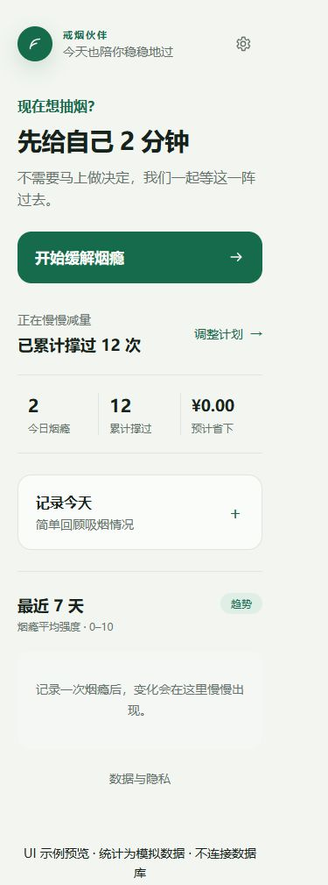

# 戒烟伙伴：微信小程序迁移与 UI 优化计划

日期：2026-09-14  
状态：迁移方案与网页 UI 首轮优化已完成；小程序原生本地体验版已实现，服务端适配和联网模式尚未开始。

## 1. 目标和边界

用已有微信原生 TypeScript 工程承载用户端，复用 Next.js API、PostgreSQL、Prisma 和现有 AI 服务。完成“建档 → 烟瘾评分 → 触发场景 → 结构化干预 → 结果反馈 → 首页统计”闭环，并迁移每日记录和数据管理。

保留网页和管理后台。首版不增加社区、课程、支付、积分、语音和通用聊天。旧路线图中“小程序后置”的安排由此次迁移计划接续，原有业务边界继续有效。

本次“迁移”首先指应用能力迁移。网页匿名用户记录不会自动变为微信用户记录；跨端身份绑定另行设计，避免误合并数据。

## 2. 当前代码结论

| 模块 | 当前状态 | 迁移处理 |
| --- | --- | --- |
| 网页 | Next.js 15、React 19、Tailwind CSS 4 | 页面按原生组件重写，保留交互规则和文案 |
| 小程序工程 | `miniprogram/`，原生 TypeScript 示例 | 保留 AppID 和工程结构，替换示例页 |
| 小程序源码 | `miniprogram/miniprogram/` | 开发者工具导入外层 `miniprogram/` |
| 用户身份 | 中间件签发匿名 Cookie，服务端读取 Cookie | 增加小程序令牌通道，继续兼容网页 |
| 首页统计 | `src/app/home/page.tsx` 直接查询数据库 | 抽出统计 service，新增 JSON 接口 |
| 干预 | 已有创建、查询、生成步骤、提交结果接口 | 复用业务，补幂等与恢复契约 |
| 每日记录 | 按日期 GET / PUT | 复用接口，统一业务日期及时区 |
| AI / 安全策略 | 服务端 Provider、fallback、输入处理 | 保留在服务端，小程序不保存模型密钥 |
| 类型与 lint | 根配置原先扫描小程序目录 | 本轮已隔离；后续建立独立小程序检查 |

## 3. 目标架构

```text
微信小程序 WXML / WXSS / TypeScript
  └─ services：request / auth / profile / cravings / dashboard / daily-log
       └─ HTTPS JSON API（现有 Next.js 服务）
            ├─ Cookie 身份（网页）/ Bearer 身份（小程序）
            ├─ 校验、归属检查、限流、幂等
            ├─ 现有业务 service 与 repository
            ├─ PostgreSQL
            └─ AI Provider → 超时或无效输出时 fallback
```

建议直接沿用已有原生工程。当前只有少量业务页，另引入跨端框架会增加构建链调整，不能直接复用现有 React 服务端页面。

建议源码结构：

```text
miniprogram/miniprogram/
  pages/home/ onboarding/ craving-start/ intervention/ result/
        daily-checkin/ settings/ privacy/
  components/score-picker/ trigger-picker/ primary-button/ inline-status/
  services/request.ts auth.ts profile.ts cravings.ts dashboard.ts daily-log.ts
  utils/storage.ts date.ts
  types/api.ts
  locales/zh-CN.ts
  styles/tokens.wxss
```

服务端校验是最终依据。共享 DTO 只包含可序列化类型，不能将 Prisma、Node API 或密钥带入小程序包。

## 4. 页面映射和 UI 方案

使用浅色、低刺激界面：用户在饭后或工作间隙单手打开手机，希望迅速得到支持。保留当前绿色品牌，缩小装饰区域，让主要动作先于统计出现。

| 网页路径 | 小程序页面 | 优化要求 |
| --- | --- | --- |
| `/`、`/home` | `pages/home/index` | 首屏直接出现“开始缓解烟瘾”；计划与统计居后；每日记录先于趋势 |
| `/onboarding` | `pages/onboarding/index` | 拆为“吸烟情况 / 常见场景 / 戒烟计划”三步；保留本地草稿；服务端字段约束不变 |
| `/craving/start` | `pages/craving-start/index` | 评分数字清晰；8 个场景双列选项；额外输入渐进展开，不抢主操作 |
| `/craving/:id/intervention` | `pages/intervention/index` | 当前行动、可选计时、必要追问；明确显示可随时结束；进度表示“最多 5 步” |
| `/craving/:id/result` | `pages/result/index` | 中性展示前后评分；是否吸烟三选一；结果未改善时也不责备 |
| `/daily-checkin` | `pages/daily-checkin/index` | 数字输入突出；备注可选；读取失败时提供重试，防止覆盖已有记录 |
| `/settings` | `pages/settings/index` | 计划编辑、隐私、删除数据入口清晰分组 |
| `/privacy` | `pages/privacy/index` | 原生文本页；说明收集内容、AI 处理、保存与删除方式 |
| `/admin/metrics` | 保留网页 | 不移入用户端小程序 |

首版使用首页作为导航中心，原生导航栏返回；暂不新增只有空内容的底部 Tab。进入干预后带 `eventId`，结束回首页并刷新。分享入口不暴露事件 ID、用户 ID 或私密内容。

### 视觉规范

- 背景 `#f2f5f0`；表面 `#fafcf9`；正文 `#17221c`；次级文字 `#66736c`。
- 主色 `#176b4d`；强调深色 `#0d4936`；浅选中背景 `#dfeee6`。
- 本轮保持既有十六进制色值，便于网页与 WXSS 对齐；后续统一色彩空间时集中转换，不混用页面级值。
- 正文及输入以 16px 为基准；辅助文字以 14px 为目标；页面标题 28–32px。
- 主按钮高度至少 52px，交互热区至少 44px；原生端按实际设备渲染校验，不能只检查 rpx 数字。
- 圆角：输入与选项 12px，主要按钮和必要容器 16px。用留白和分隔线组织内容，避免层层卡片。
- 选中状态同时提供文字或勾选标记；评分配数字和端点含义，不能仅靠颜色。
- 150–200ms 状态反馈；取消装饰性循环动画。计时器提供文字信息，切后台按截止时间恢复。
- 支持安全区和键盘抬起，输入不被固定按钮遮挡；所有页面检查长文案、窄屏和字号放大。

### 本轮网页已实施

- 首页即时支持入口移到统计之前；缩小计划数字，增加可见的“调整计划”入口。
- 将“记录今天”放到趋势之前；统计使用分隔线，移除大面积深色卡片及装饰圆环。
- 建档、烟瘾评分、干预追问、结果和每日记录的输入文字统一为正文色。
- 集中映射中性色和操作色；提升原生表单触控高度，保留焦点及减少动画支持。

以上是网页第一轮可迁移视觉基线，不代表小程序页面已经实现。三步建档、干预恢复及端内导航属于后续阶段。



预览从实际首页组件和全局 CSS 渲染，使用独立模拟数据，不连接后端；不能用于验证统计正确性或业务导航。

## 5. API 和身份适配

以下新增接口名称为本项目拟定契约，不是当前已存在的接口。

| 接口 | 处理 |
| --- | --- |
| `POST /api/auth/wechat`（新增） | 接收登录 code；服务端换取微信标识；映射到内部用户；返回应用自有令牌和到期时间 |
| `GET /api/dashboard`（新增） | 返回 profile 摘要、今日事件数、累计撑过、预计省下、7 天趋势、可恢复事件 |
| `GET/POST/PATCH/DELETE /api/profile` | 复用，扩展统一身份解析；删除后撤销该用户令牌和本地缓存 |
| `POST /api/cravings` | 加请求幂等键，解决重复点击、响应丢失后的重复创建 |
| `GET /api/cravings/:id` | 扩展步骤恢复字段；仍按用户检查归属 |
| `POST /api/cravings/:id/intervention` | 保留步数限制和状态机；重复请求同一步返回已保存结果，避免重复调用 AI |
| `POST /api/cravings/:id/result` | 重试不重复计入结果；冲突状态返回可理解的错误 |
| `GET/PUT /api/daily-log/:date` | 复用；明确日期按 Asia/Shanghai 解释，网页和小程序一致 |

身份实现要求：

1. 新增独立微信身份映射（内部 `userId`、`appId`、`openId`，组合唯一），迁移现有数据时不修改匿名用户归属。
2. 服务端保管 AppSecret、微信会话密钥和 AI 密钥；小程序只保存应用自有令牌。
3. 同一个微信身份重复登录回到同一内部用户；令牌支持到期、撤销和数据删除。
4. 统一身份入口兼容网页 Cookie 与小程序 Bearer；若携带无效 Bearer，明确返回 401，不悄悄创建匿名身份。
5. 登录刷新使用单一进行中的请求，避免并发刷新；写请求只有具备幂等保障时才自动重放。
6. 更新中间件的身份和限流逻辑，不再只以 Cookie 作为小程序限流键。用户间读取、修改、删除必须隔离。

### 干预恢复是 P0

当前查询序列化只返回步骤序号、动作类型、文案、回复和创建时间，缺少原始动作时长、追问等完整展示数据。迁移时需要保存并返回可恢复的结构化输出及截止时间，明确索引从 0 开始。

- `onHide` 保存事件和当前步骤引用，释放页面计时器；以服务端已保存状态为准。
- `onShow` 查询事件，恢复当前步骤，不重新生成第 0 步。
- 倒计时按截止时间减当前时间计算，不能假设计时回调在后台持续运行。
- 事件已完成则跳到结果或首页；已删除、无权访问、过期分别给出明确处理。
- 请求超时但可能已写入时先查询状态；网络断开保留输入并显示重试，不伪装成保存成功。
- 数据库事务与唯一约束保证 `(eventId, stepIndex)` 唯一；AI 生成中的并发请求需要锁定或请求状态记录。

## 6. 实施里程碑

工期为单人开发粗估，不含主体准备、外部审核与等待；需要在环境验证后调整。

| 阶段 | 预计 | 工作项 | 完成标准 |
| --- | --- | --- | --- |
| M0 基线 | 0.5 天 | 网页 UI 首轮优化、迁移文档、工具链隔离 | 可审查差异，网页校验通过；小程序工程配置保留 |
| M1 端内基础 | 0.5–1 天 | 请求封装、环境配置、通用状态组件、导航、设计 token | 模拟数据可浏览页面；加载、失败、空态可验证 |
| M2 后端适配 | 1–2 天 | 微信身份、令牌、dashboard、恢复结构、幂等 | 身份隔离、到期恢复、同一步重试与统计接口测试通过 |
| M3 核心闭环 | 2–3 天 | 建档、首页、烟瘾评分、干预、结果 | 真后端跑通；切后台、重进、超时重试不丢步骤 |
| M4 配套页面 | 0.5–1 天 | 每日记录、计划编辑、隐私、删除 | 修改和删除影响正确用户，首页及时刷新 |
| M5 实机与体验版 | 1–2 天 | iOS/Android、弱网、长内容、发布配置 | 核心缺陷清零，体验版完成验收再准备提审 |

合计约 6–10 个开发日。顺序依赖 M0 → M1/M2 → M3 → M4 → M5，页面可先以明确标记的模拟数据实现，不能把模拟数据当生产记录。

## 7. 验收清单

### 功能和数据

- [ ] 新用户完成建档，关闭后重新进入仍能读取档案。
- [ ] 同一微信身份再次登录不产生重复用户；不同身份不能读取对方事件。
- [ ] 0 和 10 分、全部 8 个场景、三种结果均可提交。
- [ ] 多次点击、超时重试不产生重复事件、步骤、结果或埋点。
- [ ] 前后评分、是否吸烟、累计撑过和趋势与后端记录一致。
- [ ] 跨零点、日期空值、价格未填、零记录等边界一致。
- [ ] 干预切后台 30 秒、页面重进、会话到期后恢复正确。
- [ ] AI 超时或无效输出仍展示后端 fallback；断网不会显示假成功。
- [ ] 删除数据需二次确认，成功后移除草稿、活动事件和令牌；旧令牌不可继续访问。

### UI 和交互

- [ ] 在 320、375、390、430px 宽度无横向滚动。
- [ ] 常规手机首屏可见“开始缓解烟瘾”按钮，主要触控热区不小于 44px。
- [ ] 加载、空态、错误、禁用、成功均有清晰反馈。
- [ ] 键盘展开、安全区、字号放大下主要按钮可达且内容不被遮挡。
- [ ] 评分有数字、端点说明；选择项有非颜色提示；焦点和可访问名称明确。
- [ ] 文案不预设评分下降或未吸烟，不使用惩罚语气。

### 工程和上线

- [ ] 网页 lint、类型检查、单元测试、生产构建通过。
- [ ] 小程序独立类型检查及开发者工具编译通过。
- [ ] iOS 和 Android 微信实机完成完整闭环与弱网检查。
- [ ] 生产域名、证书、服务端环境变量、数据库迁移和备份完成验证。
- [ ] 小程序主体、服务类目、隐私声明、平台要求由上线负责人在当前控制台核验。
- [ ] 保留现有网页入口；异常时停止小程序放量，避免破坏原有数据和接口。

## 8. 外部依赖与待核验事项

开发可先使用 mock AI 和本地测试接口。正式登录联调需要对应 AppID 的服务端配置；生产网络联调需要可用 HTTPS API 域名。密钥通过服务端环境注入，不提交仓库。

平台接口和审核要求需以当前微信文档及实际控制台为准。本次尝试读取官方页面未成功，因此下列链接作为实施阶段核验入口，不能视作已核验的平台政策：

- [微信小程序登录](https://developers.weixin.qq.com/miniprogram/dev/framework/open-ability/login.html)
- [网络能力](https://developers.weixin.qq.com/miniprogram/dev/framework/ability/network.html)
- [页面生命周期](https://developers.weixin.qq.com/miniprogram/dev/reference/api/Page.html)

不会把网页匿名身份按设备、IP 或昵称自动合并到微信账户。如果后续要求继承已有网页数据，需要增加一次性绑定凭证、双端确认、冲突与撤销方案，并单独验收。

## 9. 本轮验证记录

以下记录来自网页 UI 首轮修改，小程序的最新状态见第 10 节。

- `npm run lint`：通过。
- `git diff --check`：通过。
- 首页独立预览：320、375、390、430px 宽度均无横向溢出；主操作高度约 59px，位于首屏。
- `npm test`：14 个测试文件、41 项测试通过；另外 3 个套件因 Prisma 客户端未生成而加载失败。不可标记为全套通过。
- `npm run typecheck`：未通过，出现 Prisma 类型缺失及其连带类型推断错误。
- `npm run db:generate`：沙箱内引擎下载失败；提权下载请求被拒绝，未继续下载。
- 生产构建、真实数据库闭环、表单完整交互与微信实机检查尚未完成。依赖恢复后先生成 Prisma 客户端，再重跑检查。

## 10. 小程序开发进度（2026-09-14）

已在用户创建的 `miniprogram/` 下完成原生本地体验版，保留原 AppID 和项目配置。

- 8 个原生页面：首页、三步建档、烟瘾评分、分步支持、结果反馈、每日记录、设置、隐私。
- 本地数据服务：持久化、草稿恢复、真实统计、同一事件重复写入保护、按截止时间恢复计时。
- 同一时刻只保留一条进行中的支持记录；首页可继续；结果提交后刷新统计。
- 默认干预后评分与干预前一致，等待用户调整；不会预填降低的评分。
- 清晰标记本地模式，预设内容不伪装为实时 AI；不进行微信登录或上传。
- 独立类型检查通过，15 项业务 / 页面流程测试通过，微信 WXML / WXSS 编译器检查通过。

电脑操作权限未授予微信开发者工具，因此未执行模拟器交互或实机验收。此次编译检查不代表完成完整平台运行验收。

里程碑：M1 的页面基础与本地服务已实现；M3 / M4 的本地交互已实现；M2 后端适配、M3 / M4 真后端联调、M5 实机与体验版发布仍待完成。当前本地实现是开发阶段交付，不替代正式联网迁移。

下一步：微信身份与应用令牌、dashboard API、服务端干预恢复及幂等，然后将原生页面接入真实后端。原有本地记录不自动上传，需单独设计同步与授权。

运行和手动验收步骤见 [小程序说明](../miniprogram/README.md)。
